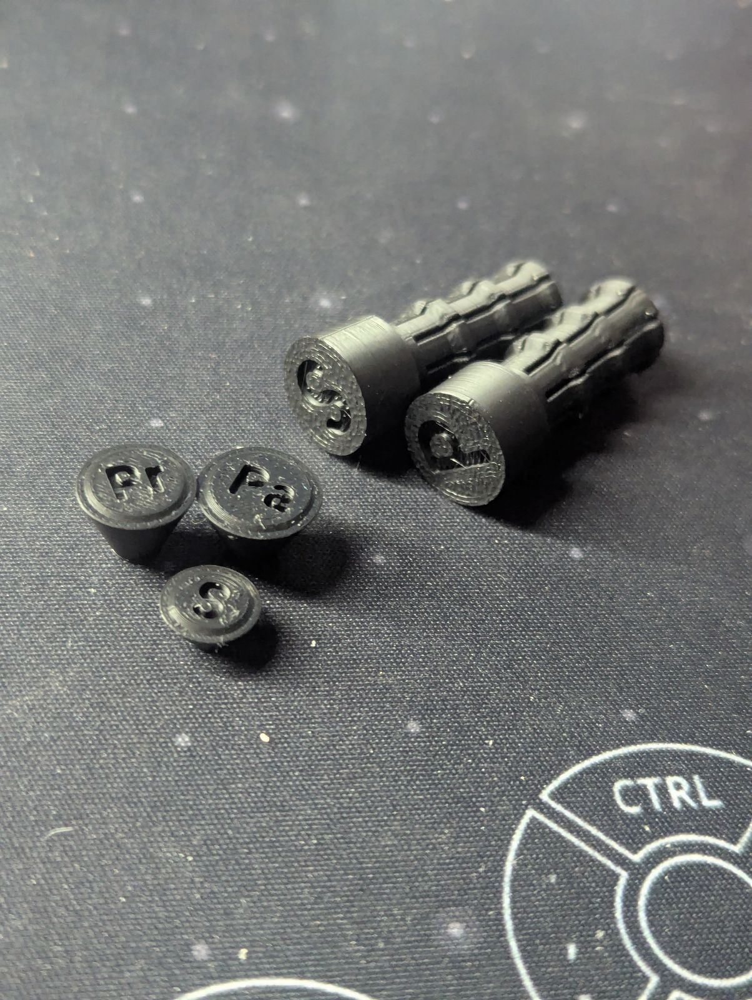

# Rubber Ring Mounting Tools

    

## Instructions

For each switch size (primary, secondary, and paddle or pinky), two files are provided: a cone and a plunger. The plunger marked with `P` can be used with both the paddle `Pa` and primary `Pr` cones. The secondary plunger marked with `S` is used with the secondary cone. 

To install a rubber ring onto a switch, follow these steps:

1. Remove the switch from the device and place it on a flat, stable surface.
2. Select the appropriately sized cone for the switch. Position the cone so that the larger diameter face, with the slight boss, is inserted into the tip of the switch.
3. Place the rubber ring onto the smaller diameter end of the cone.
4. Align the cone tip with the "fingers" of the plunger, ensuring that the tips of each plunger finger rest on the inner diameter of the X ring.
5. Press down on the plunger evenly, applying consistent force. The X ring should move smoothly down the cone, evenly on all sides, until it reaches the edge and slides into place.

## Rubber X-ring sourcing

If you need to get some replacement rubber rings, or just want to know what sizes we use these are a good reference (CAD available on McMaster-Carr)
- [No. 10 Xring used for primary and paddle caps](https://www.mcmaster.com/catalog/130/4009/90025K133)
    - You could consider [No. 11](https://www.mcmaster.com/catalog/130/4009/90025K135) for the paddle caps, however they won't be as secure
- [No. 9 XRing used for secondary caps](https://www.mcmaster.com/catalog/130/4009/90025K129)

## Printing

These were printed with the standard `0.08mm Extra Fine @BBL A1M` print profile for Basic PLA on the A1 Mini.
